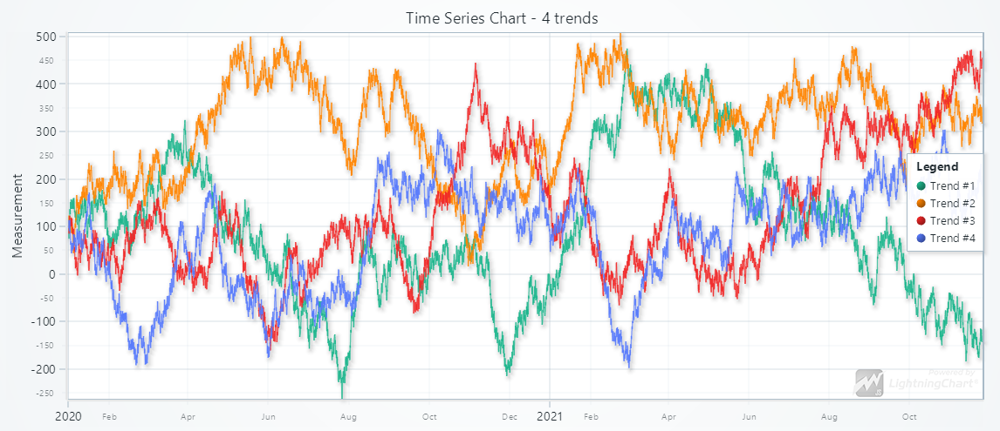

# react-time-series-chart

`react-time-series-chart` is a simple but powerful React component for interactive, heavy-duty **Time Series Charts**.



## Installation

```bash
npm i @arction/react-time-series-chart
```

## Licensing

Using `react-time-series-chart` requires a license key. Get a free 30 day trial from
[our web site](https://lightningchart.com/js-charts/#license-key).

## Basic usage

```tsx
<LightningChartXY
	id='chart'
	license='my-free-trial-license-key'
	data={[
		[
			{ x: Date.UTC(2023, 0, 1), y: 1 },
			{ x: Date.UTC(2023, 0, 2), y: 2 },
			{ x: Date.UTC(2023, 0, 3), y: 3 },
			{ x: Date.UTC(2023, 0, 4), y: 4 },
			{ x: Date.UTC(2023, 0, 5), y: 4.5 },
		],
	]}
/>
```

For extended usage instructions, see [Documentation](./documentation.md).

## Why `react-time-series-chart`?

NPM has many React data visualization packages available. Most of them are built by utilizing some JavaScript data visualization library,
such as _chart.js_, _d3.js_, etc. `react-time-series-chart` is based on [LightningChart JS](https://lightningchart.com/js-charts/), the
**most powerful charting solution in the world**. This gives it several incredible advantages compared to other options:

1. **Incredible loading speed and data capacity**

`react-time-series-chart` can display a data set with _10 million data points in 0.1 seconds_.

2. **Built-in Time Series support**

No more hacks with tick placement and label formatting. Input data directly from a database with UTC timestamps and enjoy built-in Time
Series support.

3. **Out of the box analysis tools and user interactions**

No extra work needed for data cursors, panning, zooming, etc.

4. **Lightning-fast rendering speed**

All operations, interactions, updates etc. are refreshed with 60 FPS - always. No more laggy user experiences.

5. **Modern graphics, visual look, animated quality of life experience**

By default, `react-time-series-chart` looks stunning and modern. If you need old printed-paper style charts, that is also easily possible by
changing the Color Theme.

## Documentation

In order to keep this page from expanding out of control, documentation is found on a [separate page](./documentation.md).

## Discover LightningChart

`react-time-series-chart` is based on [LightningChart JS](https://lightningchart.com/js-charts/), the global pioneer in high-performance
data visualization software. One important point to address here is:

> `react-time-series-chart` is a very small software package, with less than 100 lines of code.

This software is only boiler-plate, wrapper code for connecting a React application to LightningChart JS. And the catch is that **you can
adapt it for anything**.

LightningChart JS serves hundreds of different data visualization use cases, real-time, historical, line charts, scatter charts, area
charts, box plots, heatmaps, 3D charts, Polar charts, Polar heatmaps, Pie charts, Funnel charts, Pyramid charts, Gauge charts - there is an
insane number of features in LightningChart JS.

`react-time-series-chart` exposes only a very small portion of these features. But you can make your very own React component, that utilizes
the exact LightningChart features that you need. For references, see:

-   [`react-time-series-chart` source code](./src/LightningChartXY.tsx)
-   [LightningChart JS Example Gallery](https://lightningchart.com/js-charts/interactive-examples/)
-   [LightningChart JS Developer Documentation](https://lightningchart.com/js-charts/docs/)
-   [LightningChart JS for React Documentation](https://lightningchart.com/js-charts/docs/frameworks/react/)
-   [LightningChart JS Product Page](https://lightningchart.com/js-charts/)
